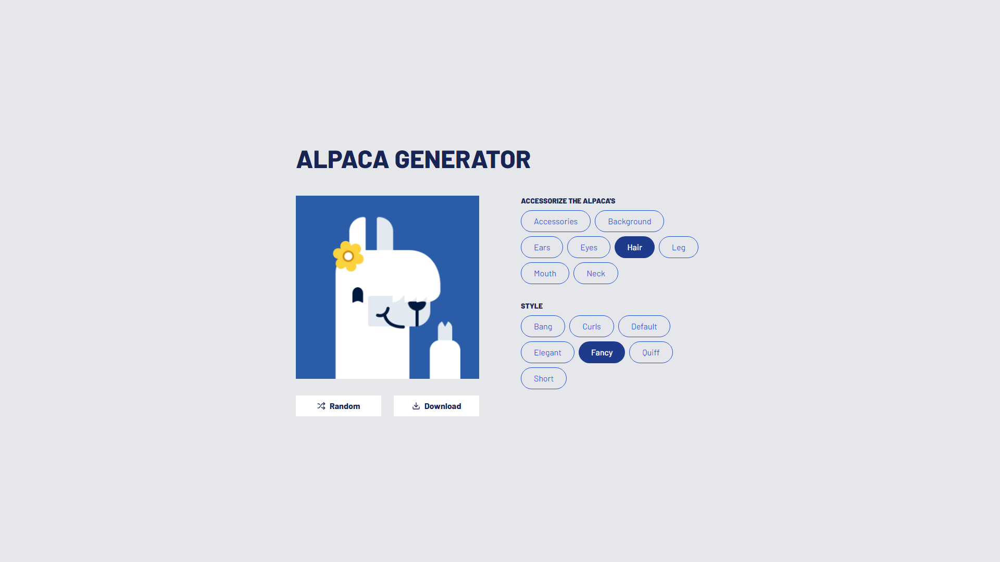

# DevProjects - Alpaca image generator website

This is an open source project from [DevProjects](http://www.codementor.io/projects). Feedback and questions are welcome!
Find the project requirements here: [Alpaca image generator website](https://www.codementor.io/projects/web/alpaca-image-generator-website-ce2oc0eus8)

## Tech/framework used

- [Next.js](https://nextjs.org/)
- [Tailwind CSS](https://tailwindcss.com/)

## Screenshots



## Installation

1. **Clone the Repository**:

```bash
git clone https://github.com/furkan-kayis/alpaca.git
```

2. **Navigate to the Project Directory**:

```bash
cd alpaca
```

3. **Install Dependencies**:

```bash
pnpm install
```

### Development

To run the project in development mode, use the following command:

```bash
pnpm dev
```

Your Next.js application will start on http://localhost:3000.

### Building for Production

To build the project for production, use the following command:

```bash
pnpm build
```

### Starting in Production Mode

To start the project in production mode, use the following command after building:

```bash
pnpm start
```

### LICENCE

This project is licensed under the MIT License - see the [LICENSE.md](/LICENSE) file for details.
